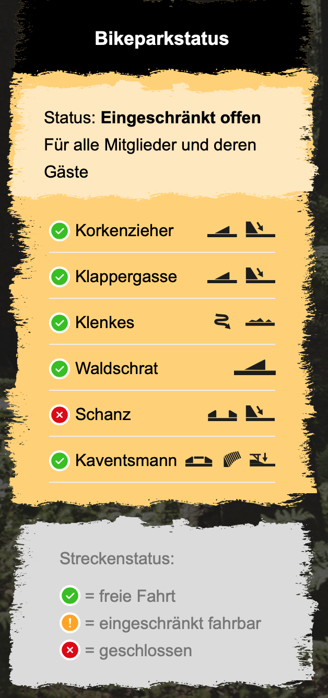

# wp-bikepark-status
Wordpress "Bikepark Status" Plugin

## Abstract 
This plugin shows the current status of the Bikepark tracks. 
Track closures and / or warnings can be assigned directly to the tracks. 
The track status can be set comfortably via the admin view. 

## Preview

